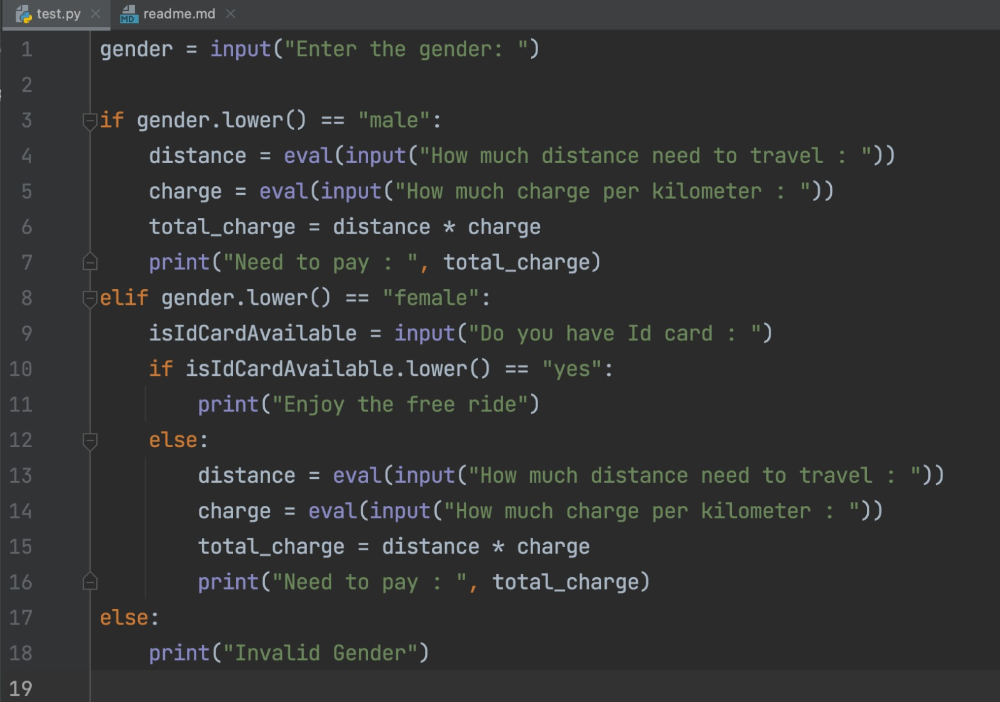

#  How to get current working directory
~~~python
import os
os.getcwd()
# Output: dhananjaya.singhar/Library/CloudStorage/Drive/Data_Science_Class/test.py
~~~

# Variable Declaration
~~~python
num=10        # VALID
num123=20     # VALID
NUM=70        # VALID
num_123=200   # VALID

#num$123=100   # INVALID
#num 123=300   # INVALID
~~~

- Variables are case sensitive
- Variables can be capital and small letter
- Variables doesn't allow special char
- Only '_' can be variable
- Variable doesn't contain any space between words
- Variable cannot prefix with numbers
- Variable can suffix with numbers
- variable cannot contain any keywords like if, for etc...

# Check type of Variable
~~~python
num=234
type(num)
~~~ 

- In Python, we don't need to define datatype while defining variable
- type(variableName) used to check the type of variable

# Types of Datatypes
- int
- str
- complex
- list
- tuple
- range
- bytes
- bytearray
- dict
- set
- frozenset
- bool
- None

## DataType: int

~~~python
Decimal: 37
Binary: 0b100101
Octal: 0o45
Hexadecimal: 0x25
~~~

### Number System

### Number conversion

~~~python
print(bin(37)) # 0b100101
print(oct(37)) # 0o45
print(hex(37)) # 0x25
~~~

## DataType: bool
~~~python
isAvailable = True
# isAvailable = TRUE # INVALID
# isAvailable = true # INVALID

print(type(isAvailable)) # <class 'bool'>
~~~

## Type Cast functions
~~~python
num = 100
num_float = float(num)   ## Convert Integer to float
num_str = str(num)  ## Convert Integer to String
bool_int = int(True) # 1 Convert boolean to int
bool_value = bool(0) # false
bool_value1 = bool('') # false
num1 = str('100.25') #  [invalid literal for int() with base 10: '100.25']
~~~
####  While converting string with float value to int , we will above get error.

---

## How to import a package in python?
~~~python
import random

print(dir(random)) # Show all methods inside package
# help(random.randint) # Show the method definition
~~~
### How to call methods / parameters inside package?
~~~python

import sys
import random
import math
import time
import keyword

print(random.randint(0, 1000)) # 780
print(sys.executable) # /opt/anaconda3/bin/python
print(keyword.kwlist) # ['False', 'None', 'True', ...]
print(math.sqrt(144))  #12
print(math.pi)  # 3.141592653589793
time.sleep(5)
print(time.time_ns()) # 1716957146486703000

~~~
## How to install and import outside package 
~~~ python
pip install cv2  
OR
pip install opencv-python

import cv2
import streamlit
~~~

## Use of Format and Round methods

~~~ python
name = "DJ"
print("Hello {} Good Morning".format(name))
print(f"Hello {name} Good Morning")

num = 60.927111
print(round(num)) # 61
print(round(num, 2)) # 61.93
~~~

## What is use of end, sep operator
~~~python
print("Hello", end=' ')
print("World")
# Output: Hello World

print("Hello", "Good Morning", sep=' :) ')
# Output: Hello :) Good Morning
~~~

## How to get input from system keyboard
~~~python
##### approach 1
num1 = input()
num2 = input()

add = int(num1) + int(num2)
print(add)

##### approach 3
num1 = eval(input("Enter the 1st number : "))
num2 = eval(input("Enter the 2nd number : "))

print(num1 + num2)
~~~

### # WAP to find add, sub, mul, div from two inputs
~~~python
num1 = eval(input("Enter the 1st number : "))
num2 = eval(input("Enter the 2nd number : "))

print(f"Addition of {num1} & {num2} is {num1 + num2}")
print(f"Multiplication of {num1} & {num2} is {num1 * num2}")
print(f"Subtraction of {num1} & {num2} is {num1 - num2}")
print(f"Division of {num1} & {num2} is {round(num1 / num2)}")
~~~

### # WAP to find the average
~~~python
num1 = eval(input("Enter the 1st number : "))
num2 = eval(input("Enter the 2nd number : "))
num3 = eval(input("Enter the 3rd number : "))

avg = round((num1 + num2 + num3) / 3, 2)

print(f"the average of {num1} & {num2} & {num3} is {avg}")
~~~

### # WAP to find the tip % amount from bill.
~~~python
billAmount = eval(input("Enter Bill Amount : "))
tipPercentage = eval(input("Tip % : "))

tipAmount = (billAmount * tipPercentage) / 100
totalBill = billAmount + tipAmount

print(round(totalBill, 2))
~~~

### # WAP to find the area by providing the radius
~~~python
# Approach-1
import math
input_radius = eval(input("Enter the radius : "))
area = math.pi * input_radius * input_radius
print(f"The area of the circle with radius {input_radius} is {round(area, 2)}")

# Approach-2: 
import math
input_radius = eval(input("Enter the radius : "))
area = math.pi * (input_radius ** 2)
print(f"The area of the circle with radius {input_radius} is {area:.2f}")
~~~

### # WAP to calculate triangle by taking input of height and breadth
~~~python
breadth = eval(input("Enter the breadth : "))
height = eval(input("Enter the height : "))
triangle = (breadth * height) / 2
print(f"The triangle of the circle with height {height} and {breadth} = {round(triangle, 2)}")
~~~
### # WAP to ask the user to calculate the area and perimeter of the rectangle

~~~python
# Approach- (Hardcoded value)
length = 10
breadth = 20
area = length * breadth
perimeter = 2 * (length + breadth)
print(f"area of length {length} and breadth: {breadth} is {round(area, 2)} and perimeter: {round(perimeter, 2)}")

# Approach-2 (Input from Key board)
length = eval(input("Enter the length: "))
breadth = eval(input("Enter the breadth: "))
area = length * breadth
perimeter = 2 * (length + breadth)
print(f"area of length {length} and breadth: {breadth} is {round(area, 2)} and perimeter: {round(perimeter, 2)}")

# Approach-2 (Input from Key board)
import random
length = random.randint(1, 100)
breadth = random.randint(1, 100)
area = length * breadth
perimeter = 2 * (length + breadth)
print(f"area of length {length} and breadth: {breadth} is {round(area, 2)} and perimeter: {round(perimeter, 2)}")
~~~
### # WAP to ask the user to calculate the volume of cylinder
~~~python
import math

radius = eval(input("Enter the radius : "))
height = eval(input("Enter the height : "))
volume = math.pi * radius * radius * height
# volume = math.pi * radius ** 2 * height
print(f"Volume of cylinder of radius {radius} and height {height} = {round(volume, 2)}")
~~~
### # if condition
~~~pythod
name = input("Enter name : ")
if name.upper() == "DJ":
    print(f" Hello {name}")
~~~

### # if else condition
~~~python
num = eval(input("Enter a number : "))
if num % 2 == 0:
    print(f" {num}  is a even number")
else:
    print(f" {num} is a odd number")
~~~

### # if elif and else condition
~~~python

import random

num = random.randint(0, 3)
if num == 0:
    print("Number = 0")
elif num == 1:
    print("Number = 1")
elif num == 2:
    print("Number = 2")
else:
    print("Number = 3")
~~~

<!-- ### Example:  -->

<!-- 

 -->

### try-except in python
~~~python

#Approach: 1
try:
    number = int(input("Enter a number: "))
    var = number / 0
    print("number:", var)
except:
    print("Unknown error")

    
    
# Approach-2
try:
    number = int(input("Enter a number: "))
    var = number / 0
    print("number:", var)
except ZeroDivisionError as ex:
    print("ZeroDivisionError occurred : ", ex)
except ValueError as ex:
    print("ValueError occurred: ", ex)
except Exception as ex:
    print("Unknown error: ", ex)

# Approach-3
def add(num1, num2):
    return num1 + num2

try:
    number_1 = eval(input("Enter First Number : "))
    number_2 = eval(input("Enter Second Number : "))
    output = add(number_1, number_2)
    print(f"Output : {output}")
except Exception as ex:
    print(f"Error:{type(ex).__name__} occurred, message : {ex}")
    # Error:NameError occurred, message : name 'python' is not defined

~~~

## How to create Functions/methods in python
~~~python
def calculate(num1, num2, operation):
    if operation < 1 or operation > 4:
        return -1

    if operation == 1:
        print(f"Performing addition of {num1} & {num2}")
        return num1 + num2
    elif operation == 2:
        print(f"Performing subtraction of {num1} & {num2}")
        return num1 - num2
    elif operation == 3:
        print(f"Performing multiplication of {num1} & {num2}")
        return num1 * num2
    else:
        print(f"Performing division of {num1} & {num2}")
        return num1 / num2

try:
    number_1 = eval(input("Enter First Number : "))
    number_2 = eval(input("Enter Second Number : "))
    op_type = eval(input("Enter the operation add[1], sub[2], mul[3], div[4] : "))
    output = calculate(number_1, number_2, op_type)
    print(f"Output : {output}")
except Exception as ex:
    print("Error: ", ex)
~~~

## Use of "main" function
~~~python
def add(num1, num2):
    return num1 + num2

def main():
    try:
        number_1 = eval(input("Enter First Number : "))
        number_2 = eval(input("Enter Second Number : "))
        output = add(number_1, number_2)
        print(f"Output : {output}")
    except Exception as ex:
        print("Error: ", ex)

if __name__ == "__main__":
    main()
~~~

## Use of global keyword
~~~python
total = 0

def add(value):
    global total
    total = total + value
    return total

add(10)
add(20)
print(total) # 30
~~~
## How to print global and local with same name
~~~python
num=10;

def show(num):
    print(globals()['num']) # 10
    print(num) # 20
    
show(20)
~~~

## How to return multiple values from a method
~~~python
def m1():
    return 10, 20, 30

res1,res2,res3 = m1()

print(res1, res2, res3)
~~~

## How to throw Exception in python
~~~python
def isValid(value):
    if(value != "python"):
        raise ValueError("Invalid input")    
    
    return True

try:
    print(isValid("python"))
except Exception as ex:
    print(f"{type(ex).__name__} :: {ex}")
~~~

## How to throw Custom Exception in python
~~~python

class ApplicationException(Exception):
    def __init__(self, message): # Constructor
        self.message = message
        super().__init__(self, message)
        

def isValid(value):
    if(value != "python"):
        raise ApplicationException("Invalid input")    
    
    return True

try:
    print(isValid("p1ython"))
except Exception as ex:
    print(f"{type(ex).__name__} :: {ex.message}")
    
~~~

## How to define dataType to variable and return type of a method
~~~python
def add(a: int, b: int) -> int :
    return a + b

print(add(1, 2))
~~~

## Use of ForLoop
~~~python
#Approach-1
for i in range(5):
    print(i, end = " ")

# Approach-2
for i in range(0, 5):
    print(i)

# i++ index in forward Direction
for i in range(0, 20, 1):
     print(i, end=' ') # 0 1 2 3 4 

# i-- index in backword Direction
for i in range(5, 0, -1):
     print(i, end=' ') # 5 4 3 2 1 

## Approach-4
import keyword

for i in keyword.kwlist:
    print(i) 
    # False, None, True, and, as, assert, async, await, break, class, continue, def, del, elif, else, except, finally, for, from, global, if, import, in, is, lambda, nonlocal, not, or, pass, raise, return, try, while, with, yield
~~~

## Break in loop
~~~python
def findNum(num):
    for i in range(100):
        if i == num :
            print(f"Found {num}")
            break
    
findNum(20)
~~~

## in operator
~~~python
name = "python"

for i in name:
    print(i, end= " ") # name = "python"
    
    
if("t" in name):
    print("Hello")
~~~
## Use of ord and chr method (ASCII)
~~~python
import string
print(ord('A')) # 65
print(chr(65)) # A

for i in string.ascii_uppercase:
    print(f"{i}: {ord(i)}")
~~~
## While Loop
~~~python
count = 0
while(True):
    print(count)
    count = count + 1
    if count > 5:
        break
~~~

